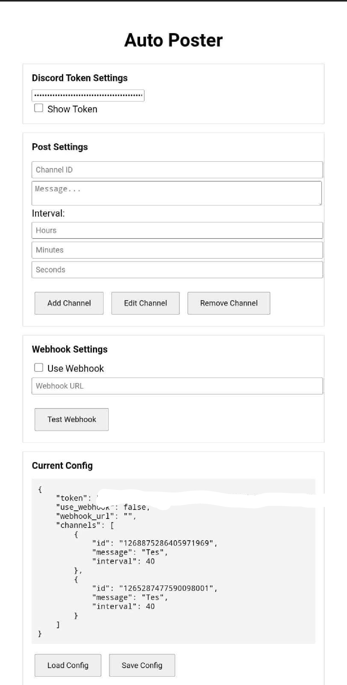

# Auto-post

This project auto-posts messages to Discord channels with interval and optional webhook logging.

> Warning: This tool breaks Discord Terms of Service. Use at your own risk. I’m not responsible for any bans or consequences.


## Setup Instructions on termux

**Install Termux:**
[Download Termux here](https://f-droid.org/en/packages/com.termux/)


**Clone the repo & install requirements:**
```bash
pkg update && pkg install git python -y
git clone https://github.com/lantas-bit/Auto-post
cd Auto-post
pip install flask requests
```

**Run the bot:**
```bash
python autopost.py
```
**How to get discord account token?**

[How to get token on pc](https://youtu.be/LnBnm_tZlyU?si=J3wSpuRaXqI5ycUj)

[How to get token on kiwi browser (android)](https://youtu.be/OvOKuKZwuwQ?si=LCoqhtTlKJv74VxG)

**Open in browser:**

Visit `http://localhost:5000` from your phone browser (while Termux is running).

## Setup Instructions on windows

**Install Python**

Download from: 
[Python](https://python.org)

**During installation, make sure to check “Add Python to PATH”**


**Download / clone the repository**

**[Download this repository]**
- Click the green `Code` button
- Choose **Download Zip**
- Extract the file zip

**[Cloning this repositori] Open CMD and run:**

**Install git:**
[Git](https://git-scm.com/downloads)

```bash
git clone https://github.com/lantas-bit/Auto-post
cd Auto-post
```


**If you already download and extract the Zip file run this on cmd inside the extracted folder**

**Install required packages**
```bash
pip install flask requests
```

**Run the bot**
```bash
python autopost.py
```


**Access the web controller**
Open your browser and visit:

```http://localhost:5000```

# Screenshot

